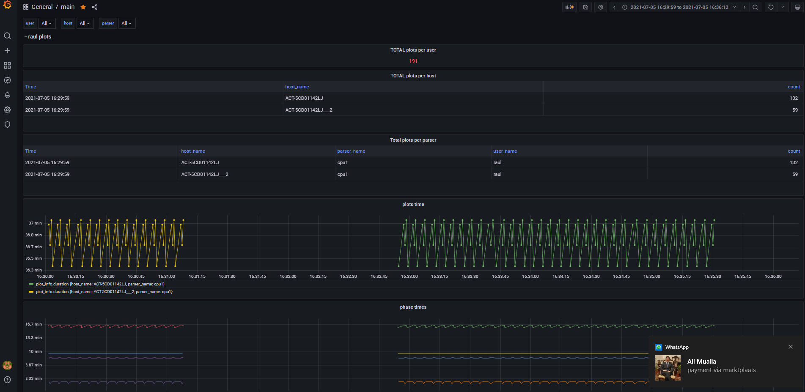

# Log parser for madmax windows

Tested with Madmax for windows:
* https://github.com/stotiks/chia-plotter/releases/tag/v0.0.6   
* https://github.com/stotiks/chia-plotter/releases/tag/v0.1.1

Tested with InfuxDB V2.

```
Log parser for madmax windows version

optional arguments:
  -h, --help            show this help message and exit
  --db_url DB_URL       InfluxDB url. Only tested with InfuxDB V2(Example: http://192.168.50.189:8086)
  --db_token DB_TOKEN   InfluxDB token
  --db_organization DB_ORGANIZATION
                        InfluxDB organization
  --db_bucket DB_BUCKET
                        InfluxDB bucket
  --parser_name PARSER_NAME
                        Give a name to this parser. Might be helpfull when multiple madmax instances are running on the same machine
  --parser_user PARSER_USER
                        Who is using this parser. Might be handy when more people save in the same database
  --file FILE           Log file to watch
```

# Install
Go to madmax_log_parser directory
```
pip install poetry
poetry config virtualenvs.in-project true
poetry install
```


Windows
```
.venv\scripts\activate
```
Linux
```
source .venv\scripts\activate
```

Run
```
python src\main.py --db_url "<db_url:port>" --db_token "<token>" --file "<file>"
```


#Grafana dashboard example



The dashboard can be found and imported from grafana directory. 